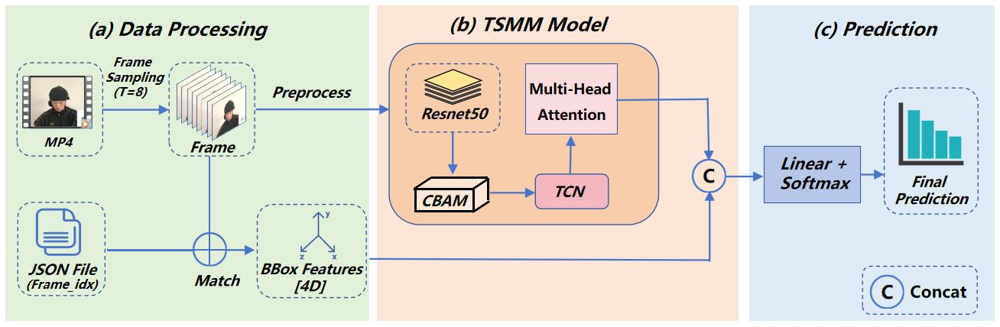
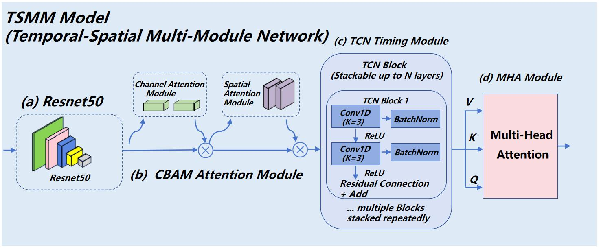
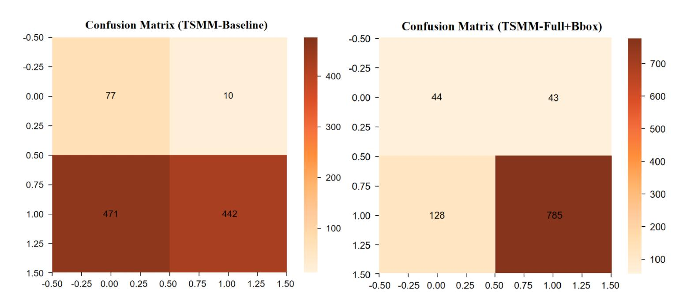

# TSMM

Official PyTorch code for **TSMM: Spatiotemporal Multi-branch Module for Deepfake Detection** (CVIP 2025).

Video-level deepfake detection with ResNet-50, CBAM, TCN, multi-head attention, and a face-bbox branch.

<p align="center">
  
</p>
<p align="center">
  
</p>

This repo ships **code only**. Dataset, checkpoints, logs, and the paper training recipe are not included.

## Installation

```bash
pip install -r requirements.txt
```

Python 3.10+, CUDA GPU recommended for training.

## Dataset

Prepare data yourself (paper: 2025 Global AI Challenge, Track 2 — Deepfake Detection). Layout:

```
data/
├── new_train_anno_file_fixed.json
├── new_test_anno_file_fixed.json
├── train_fixed/
└── test_fixed/
```

```bash
export TSMM_DATA_DIR=/path/to/data   # or use ./data
```

JSON keys must match MP4 stems.

## Training

Copy the placeholder config and fill in **your** hyperparameters locally (`configs/train.yaml` is gitignored):

```bash
cp configs/default.yaml.example configs/train.yaml
python3 train_best.py
# python3 train_best.py --config /path/to/private.yaml
```

The example YAML is **not** the paper recipe and will not match Table I/II.

```bash
python3 train_best.py --debug --no-pretrained   # smoke test
```

## Evaluation

```bash
python3 eval_test.py --checkpoint checkpoints/best_model.pth
```

## Demo

```bash
cd web && python3 app.py
```

Uploaded videos have no annotation JSON. Detect a face with **your own YOLO** (weights not included in this repo) and feed the box in the same 4D normalized format as training.

## Results (from the paper)

**Table I** — full TSMM, different backbones:

| Backbone | F1 | Acc | Pre | Sen | Spe |
|----------|----|-----|-----|-----|-----|
| ConvNeXt-Base | 51.72 | 39.79 | 89.88 | 36.31 | 69.73 |
| EfficientNet-B0 | 78.51 | 68.80 | 97.68 | 0.01 | 0.89 |
| Swin-Tiny | 88.52 | 82.52 | 98.00 | 80.72 | 98.00 |
| ResNet-50 | **90.34** | **85.26** | **98.00** | **83.78** | **98.00** |

**Table II** — ablation (ResNet-50):

| Model | F1 | Acc | Pre | Sen | Spe | AUC |
|-------|----|-----|-----|-----|-----|-----|
| Baseline | 64.76 | 51.90 | 97.78 | 48.41 | 88.50 | 81.10 |
| +CBAM | 34.57 | 27.70 | 99.47 | 20.92 | 98.85 | 79.26 |
| +TSM | 72.77 | 60.50 | 98.14 | 57.83 | 88.50 | 82.38 |
| Full | 87.89 | 79.40 | 94.80 | 81.92 | 52.87 | 73.01 |
| Full+BBox | **90.17** | **82.90** | **94.80** | **85.98** | **50.57** | **79.69** |

<p align="center">
  
</p>

Default code path: ResNet-50 + CBAM + TCN + MHA + BBox. Extra module diagrams: [fig3](docs/figures/fig3_tcn_block.jpg), [fig4](docs/figures/fig4_mha.jpg).

## Citation

```bibtex
@inproceedings{lou2025tsmm,
  title     = {TSMM: Spatiotemporal Multi-branch Module for Deepfake Detection},
  author    = {Lou, Junsen and Zhao, Ben and Li, Tianhao and Bai, Haotian
               and Liu, Qing and Zhao, Zhuoya and Zhang, Yawen
               and Wang, Yaqi and Qin, Aihong and Zhao, Man},
  booktitle = {CVIP},
  year      = {2025}
}
```

## License

MIT. See [LICENSE](LICENSE).
